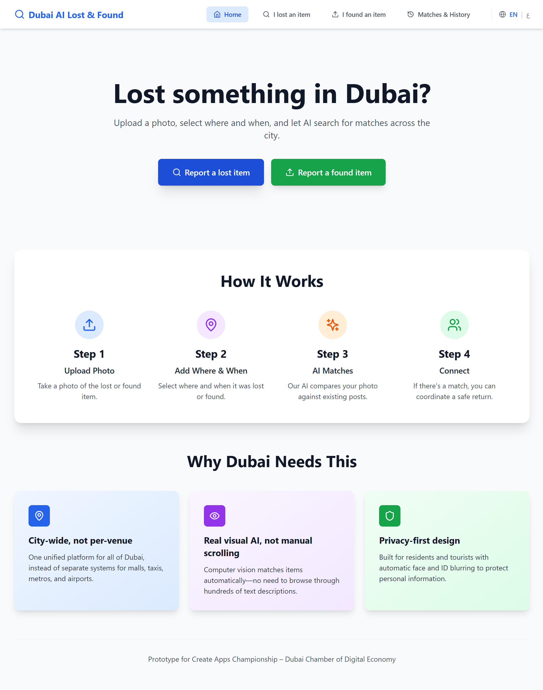
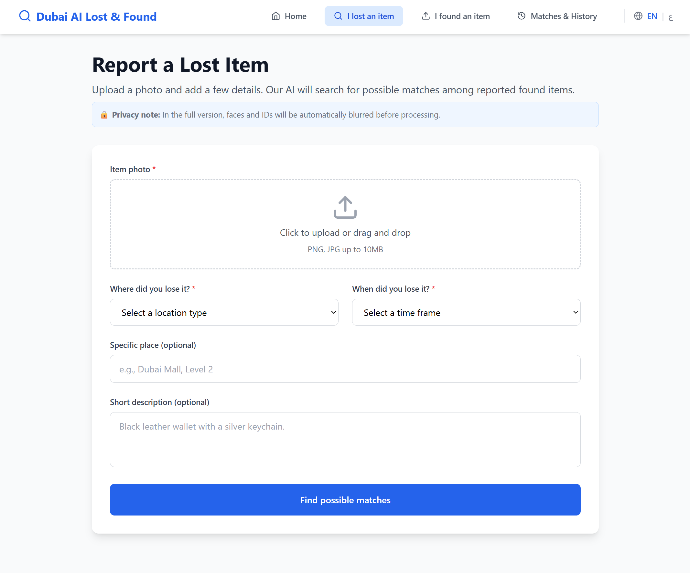
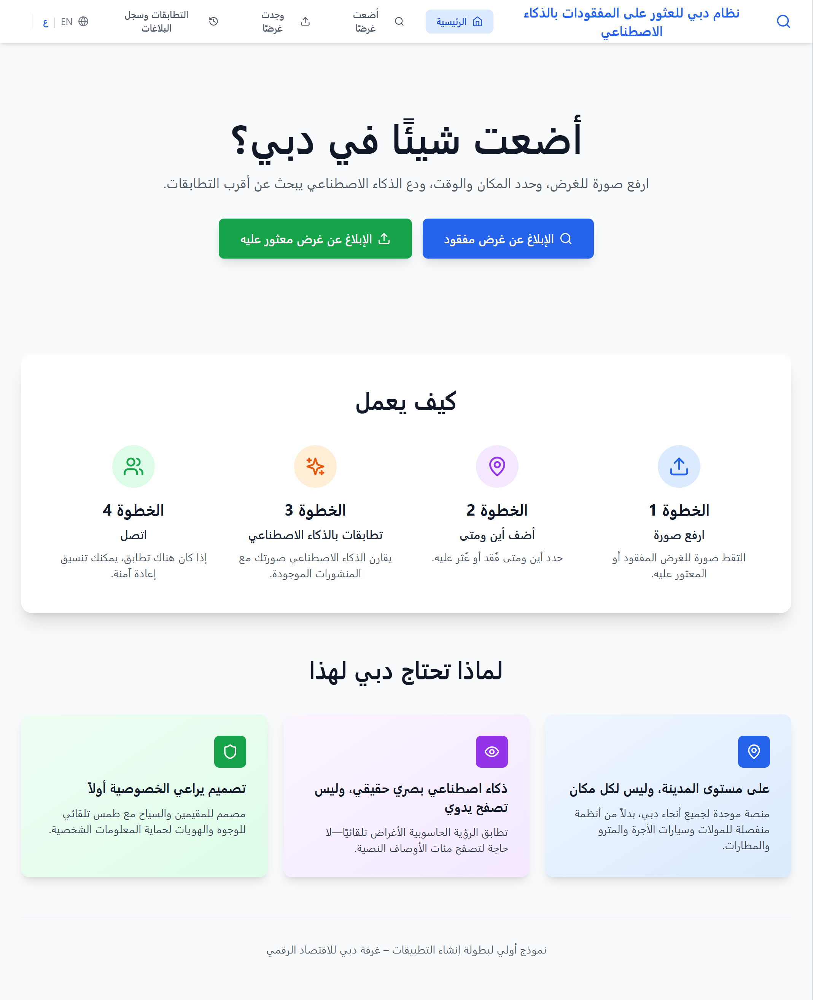
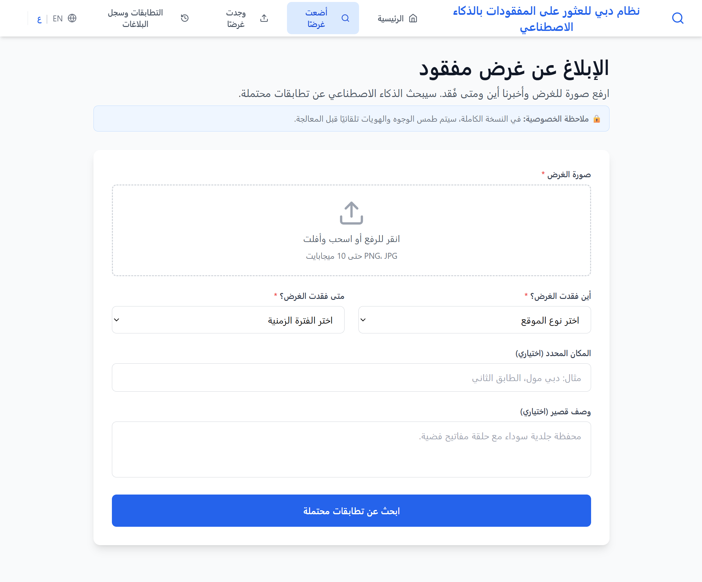
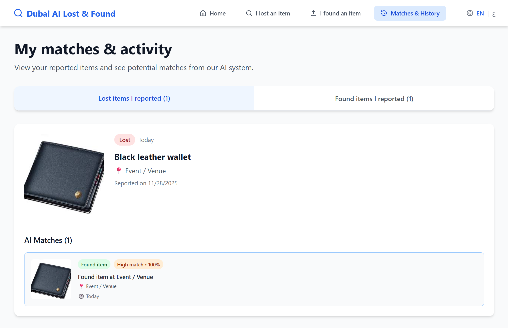
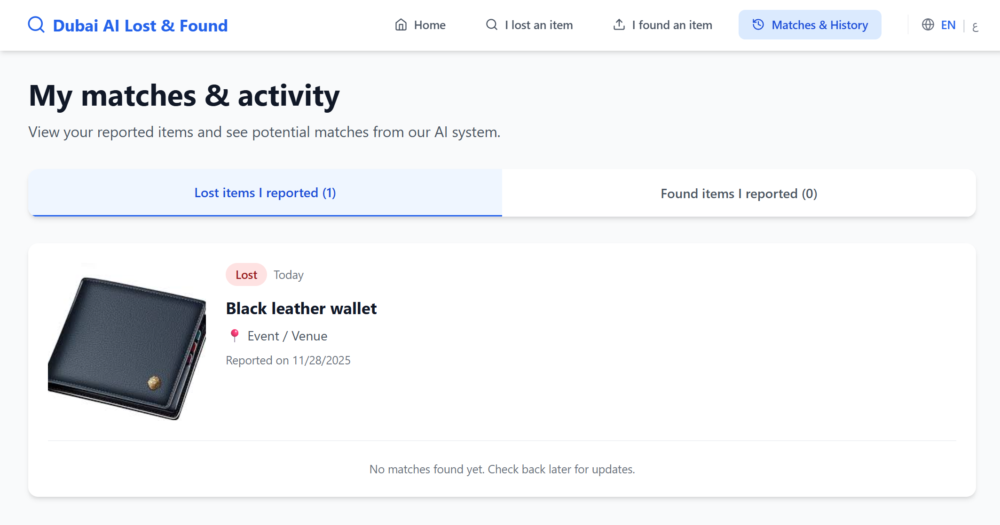

# Mafqood - مفقود 🇦🇪

> Dubai's Privacy-First, AI-Powered Lost & Found Platform  
> Upload a photo of a lost or found item, add where & when, and let visual AI suggest the best matches.

**🏆 Built for Create Apps Championship 2025 – Dubai Chamber of Digital Economy**

[](https://www.python.org/)
[](https://reactjs.org/)
[](https://www.typescriptlang.org/)
[](https://fastapi.tiangolo.com/)
[](https://pytorch.org/)

---

## 📸 Screenshots

### English Interface
<table>
  <tr>
    <td></td>
    <td></td>
  </tr>
</table>

### Arabic Interface (RTL)
<table>
  <tr>
    <td></td>
    <td></td>
  </tr>
</table>

### AI Matching in Action
<table>
  <tr>
    <td></td>
    <td></td>
  </tr>
</table>

---

## 🌍 Problem

**The Challenge:**  
Dubai hosts 3.4M residents and 17M annual tourists. When someone loses an item—a wallet, phone, or passport—they must manually check dozens of fragmented systems: mall lost-and-found desks, RTA metro stations, taxi apps, hotel reception, and social media groups.

**The Impact:**
- ⏱️ Average 2-3 days wasted searching
- 📉 Only 15% success rate in item recovery
- 😰 Stressful, time-consuming process
- 🔍 No visual search capability (text descriptions are unreliable)
- 🌐 No unified, citywide database

## 💡 Solution: Mafqood

**Mafqood (مفقود - "Lost" in Arabic)** is Dubai's first AI-powered, photo-first lost & found platform where users:

- upload a photo of a lost or found item,
- select **where** and **when** it was lost/found,
- and get **AI-powered visual matches** from other reports.

A FastAPI backend uses a pretrained CNN to compute image embeddings and return the most similar items, while a React UI provides a simple, Dubai-optimized experience.

---

## ✨ Key Features

### 🎯 Core Functionality
- **Photo-first reporting** – Start with an image, not a long form
- **Minimal details required** – Where, when, and an optional short note
- **AI visual matching** – ResNet18 CNN embeddings + cosine similarity to find similar items
- **Real-time matching** – Get instant AI suggestions as soon as you submit
- **Privacy-first design** – Architecture ready for automatic blurring of faces and ID details

### 🌐 Bilingual Support (NEW!)
- **English & Arabic** – Full UI translation for both languages
- **RTL support** – Proper right-to-left layout for Arabic
- **Language toggle** – Switch languages instantly with EN/ع toggle
- **Persistent preference** – Language choice saved in localStorage
- **Native experience** – All forms, labels, buttons, and content translated

### 🏙️ Dubai-Optimized
- **City-wide, not per-venue** – Works across malls, taxis, metro, airports, schools, and events
- **Location categories** – Tailored for Dubai's common venues
- **Time frames** – Quick selection for recent losses
- **Mobile-first design** – Responsive UI works on all devices

### 🔒 Privacy & Security
- **No public personal data** – Images processed locally, no face recognition stored
- **Architecture for blur** – Ready to integrate automatic face/ID blurring
- **Secure API** – FastAPI with proper CORS configuration
- **Local storage** – SQLite database with JSON-stored embeddings

### 📊 Advanced Features
- **Matches & activity view** – Track all your lost/found reports and their AI matches
- **Similarity scoring** – High match (≥75%) vs Possible match (≥50%)
- **Match filtering** – Only show relevant matches above threshold
- **Comprehensive testing** – 8 pytest integration tests with 100% pass rate  

---

## 🏗️ Architecture

### Tech Stack

#### Frontend
- **Framework:** React 18.3 with Vite 5.4
- **Language:** TypeScript 5.5
- **Styling:** Tailwind CSS 3.4
- **Icons:** Lucide React
- **i18n:** Custom lightweight implementation (no heavy libraries)
- **Views:** Home, Report Lost, Report Found, Matches/History
- **Deployment:** Static hosting ready (Vercel, Netlify, etc.)

#### Backend
- **Framework:** FastAPI 0.109
- **Language:** Python 3.12
- **Database:** SQLite with SQLAlchemy 2.0
- **AI/ML:** PyTorch 2.2 (CPU), torchvision 0.17, ResNet18 (pretrained on ImageNet)
- **Image Processing:** Pillow 10.2
- **Testing:** pytest 7.4 with 8 comprehensive tests
- **Server:** uvicorn with auto-reload for development

#### AI Pipeline
1. **Image Upload** → User uploads photo of lost/found item
2. **Preprocessing** → Resize to 224x224, normalize (ImageNet standards)
3. **Feature Extraction** → ResNet18 generates 512-dimensional embedding vector
4. **Storage** → Embedding saved as JSON in SQLite alongside item metadata
5. **Similarity Search** → Cosine similarity between query embedding and all stored embeddings
6. **Ranking** → Top 5 matches returned, filtered by similarity threshold (≥50%)
7. **Response** → Match results with similarity scores sent to frontend

### Project Structure
```
dubai-lostfound-ai/
├── frontend/                 # React TypeScript frontend
│   ├── src/
│   │   ├── components/       # Reusable UI components
│   │   ├── views/            # Main page views
│   │   ├── context/          # Language context provider
│   │   ├── i18n/             # Translation files (EN/AR)
│   │   ├── api/              # Backend API client
│   │   └── types.ts          # TypeScript interfaces
│   ├── public/               # Static assets
│   └── package.json
├── backend/                  # FastAPI Python backend
│   ├── app/
│   │   ├── main.py           # FastAPI application entry
│   │   ├── config.py         # Configuration settings
│   │   ├── database.py       # SQLAlchemy setup
│   │   ├── models.py         # Database models
│   │   ├── schemas.py        # Pydantic schemas
│   │   ├── crud.py           # Database operations
│   │   ├── embeddings.py     # AI model & similarity
│   │   └── routers/
│   │       └── items.py      # API endpoints
│   ├── tests/                # pytest test suite
│   │   ├── conftest.py       # Test fixtures
│   │   ├── test_health.py    # Health check tests
│   │   └── test_report_*.py  # Integration tests
│   ├── media/                # Uploaded images (lost/found)
│   ├── requirements.txt
│   └── pyproject.toml
└── docs/                     # Documentation & assets
    ├── screenshots/          # UI screenshots
    └── *.md                  # Additional documentation
```

---

## 🚀 Getting Started

### Prerequisites

- **Python 3.11+** (tested on 3.12)
- **Node.js 20+**
- **Git**

### Backend Setup

```bash
# Clone the repository
git clone https://github.com/AlBaraa-1/dubai-lostfound-ai.git
cd dubai-lostfound-ai/backend

# Create and activate virtual environment
python -m venv .venv

# Windows
.venv\Scripts\activate

# macOS/Linux
source .venv/bin/activate

# Install dependencies
pip install -r requirements.txt

# Run the server
uvicorn app.main:app --reload
```

Backend will run on **http://127.0.0.1:8000**

- API Docs: http://127.0.0.1:8000/docs
- Health Check: http://127.0.0.1:8000/health

### Frontend Setup

```bash
# Navigate to frontend directory
cd frontend

# Install dependencies
npm install

# Start development server
npm run dev
```

Frontend will run on **http://localhost:5173**

### Running Backend Tests

```bash
# Make sure you're in the backend directory with venv activated
cd backend
.venv\Scripts\activate  # Windows

# Run all tests
pytest

# Run with coverage
pytest --cov=app --cov-report=html

# Run specific test file
pytest tests/test_health.py
```

---

## 🧪 Manual Testing Flow

Follow these steps to verify the full integration:

### 1. Start Backend
```bash
cd backend
.venv\Scripts\activate
uvicorn app.main:app --reload
```

✅ Verify: Visit http://127.0.0.1:8000/health → should return `{"status": "ok"}`

### 2. Start Frontend
```bash
cd frontend
npm run dev
```

✅ Verify: Visit http://localhost:5173 → Dubai AI Lost & Found homepage loads

### 3. Report a Found Item

1. Click **"Report Found"** in navigation
2. Upload an image (e.g., wallet, phone, keys)
3. Fill in:
   - Where: "Mall"
   - When: "Today"
   - Description: "Black wallet" (optional)
4. Click **"Check for owners"**

✅ Expected:
- No errors in browser console
- "AI Suggested Matches" section appears
- Shows "No matches yet" (database is empty initially)
- DevTools Network tab shows: `POST /api/found` → Status **201**

### 4. Report a Lost Item

1. Click **"Report Lost"** in navigation
2. Upload **the same or similar image**
3. Fill in:
   - Where: "Mall"
   - When: "Today"
   - Description: "Lost my wallet"
4. Click **"Find possible matches"**

✅ Expected:
- "AI Suggested Matches" section shows **match cards**
- Each match displays:
  - Image thumbnail
  - Similarity score (e.g., "High match • 85%")
  - Location and time details
- DevTools Network tab shows: `POST /api/lost` → Status **201**

### 5. Check Matches / History

1. Click **"Matches / History"** in navigation
2. Switch between tabs:
   - **"Lost items I reported"** → Shows your lost wallet
   - **"Found items I reported"** → Shows your found wallet

✅ Expected:
- Both items display with their details
- Lost wallet shows the found wallet as a match
- Found wallet shows the lost wallet as a match
- DevTools Network tab shows: `GET /api/history` → Status **200**

### Common Issues

| Issue | Solution |
|-------|----------|
| **CORS errors** | Backend already configured for localhost:5173 ✅ |
| **Images not loading** | Fixed with `Path().name` in `crud.py` ✅ |
| **422 errors** | Check all required fields (image, where, when, title) |
| **Backend port conflict** | Change port: `uvicorn app.main:app --reload --port 8001` |

---

## 🚀 Getting Started

> WIP: this section will be updated as the backend and frontend are wired together.

### Backend

```bash
git clone https://github.com/AlBaraa-1docs/app-business-canvas.md/dubai-lostfound-ai.git
cd dubai-lostfound-ai

python -m venv .venv
# Windows: .venv\Scripts\activate
# macOS/Linux:
source .venv/bin/activate

pip install -r requirements.txt
uvicorn app.main:app --reload
```

Backend will run on http://localhost:8000.

### Frontend

```bash
cd frontend
npm install
npm run dev
```

Frontend will run on http://localhost:5173.


---

## 📊 Business & Impact

Free for residents, tourists, and individual users.

Future revenue from B2B dashboards, logistics partnerships, and API integrations with venues and mobility operators.

Key success metrics include:

- % of lost items that receive at least one AI match
- % of matched items successfully reunited
- Median time from report → first match

For the full App Business Canvas, see:
[docs/app-business-canvas.md](docs/app-business-canvas.md)

---

## 📝 License

TBD – choose MIT or similar once finalized.
